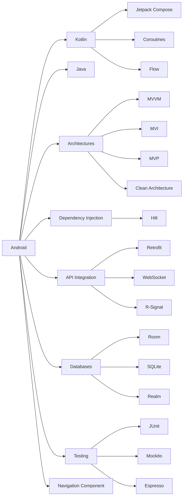

# 
👋 Hi there, I'm Arina!

  

  
  
  
  

 

## 🚀 About Me

I'm a dedicated Full Stack Developer specializing in mobile and desktop applications, web backends, and server infrastructure maintenance. My expertise spans the entire technology stack from user interfaces to server architecture.

<b>🌟 Why Work With Me</b>

 

### 🔍 **Technical Excellence**
- Deliver clean, maintainable code with comprehensive documentation
- Implement best practices and design patterns for scalable solutions
- Optimize application performance and resource utilization
- Stay current with emerging technologies and industry standards

### 🧠 **Problem-Solving Approach**
- Break down complex challenges into manageable components
- Apply analytical thinking to identify root causes of issues
- Develop innovative solutions that balance technical requirements with business needs
- Proactively identify potential problems before they impact development

### 🤝 **Collaborative Mindset**
- Communicate effectively with technical and non-technical stakeholders
- Provide constructive feedback while remaining open to others' perspectives
- Share knowledge and mentor team members to elevate overall team performance
- Adapt communication style to different audiences and project contexts

### 📚 **Continuous Growth**
- Dedicate time to learning new technologies and methodologies
- Participate in professional communities and open-source projects
- Apply lessons from previous projects to improve future outcomes
- Seek feedback and use it to enhance skills and processes

### ⏱️ **Delivery Excellence**
- Consistently meet deadlines through effective planning and prioritization
- Manage scope to ensure project objectives are achieved within constraints
- Provide accurate time estimates based on thorough analysis
- Balance quality and speed to deliver maximum value

### 🔄 **Adaptability**
- Quickly adjust to changing requirements and project priorities
- Thrive in fast-paced environments with evolving technologies
- Embrace new tools and frameworks when they offer meaningful benefits
- Maintain productivity and quality even during challenging situations

## 💻 Tech Stack

<table>
  <tr>
    <td align="center" width="96">
      
       Android
    </td>
    <td align="center" width="96">
      
       Kotlin
    </td>
    <td align="center" width="96">
      
       Java
    </td>
    <td align="center" width="96">
      
       Node.js
    </td>
    <td align="center" width="96">
      
       Python
    </td>
    <td align="center" width="96">
      
       PostgreSQL
    </td>
    <td align="center" width="96">
      
       Docker
    </td>
    <td align="center" width="96">
      
       Git
    </td>
  </tr>
</table>

## 🛠️ My Skills

### 📱 Mobile Development

### 🌐 Backend Development
- **Node.js**: Express, NestJS
- **Python**: FastAPI, Flask, Tkinter for desktop apps
- **API Management**: GraphQL, RESTful APIs
- **Real-time**: WebSockets, Socket Servers
- **Security**: JWT, OAuth

### 🗄️ Database Management
- **Relational Databases**: PostgreSQL, MS SQL
- **Optimization**: Query optimization, Index management
- **Administration**: Migrations, Replications

### 🚀 Deployment & Server Maintenance
- **Servers**: Ubuntu
- **Containerization**: Docker, Docker Compose
- **CI/CD**: GitHub Actions, Jenkins
- **Monitoring**: Prometheus, Grafana
- **Administration**: Server optimization

## 📊 GitHub Stats

  
  

## 📫 Connect With Me

  
  
  
  

 

  

